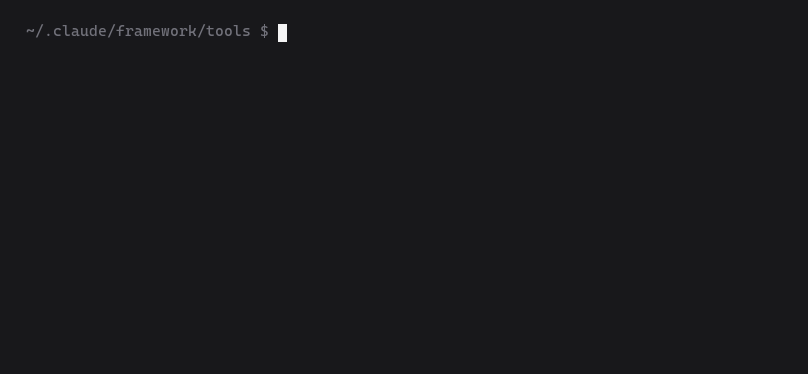

# Claude Framework

An installable, versioned **working method for Claude Code**: specialised
subagents, delegation rules, anti-hallucination rules and a context budget per
role — generated into your project, then **checked by a tool** that tells you
when the installation has drifted and carries good edits back into the source.

```
claude-framework-eng/          the versioned source — a project gets a generated copy
│
├── method/                    4 files → CLAUDE.md, loaded in EVERY context (≤2000 words)
├── coordinator/               4 files → .claude/shared/orchestration.md, opened only by
│                              whoever delegates (≤2500 words)
├── cycles/                    design · research — appended to the coordinator by profile
├── agents/                    19 subagent cards: model, effort, tool grants, mandate
│                              → .claude/agents/, 9–12 of them picked by the profile
├── profiles/                  software · library · web · data · research
│                              → roster + guides + .claude/settings.json permissions
├── shared/
│   ├── core/                  6 cross-project guides → .claude/shared/core/
│   └── domain/                data · design · research → .claude/shared/domain/
├── templates/                 TODO · status · roadmap → docs/, the state between sessions
├── skills/                    framework-install · framework-doctor · framework-sync
│                              → .claude/skills/, invoked as slash commands
└── tools/fwbuild/             assemble · kernel · profile · doctor · source · report
                               Python stdlib only · 160 tests
```



*An installed project, checked. The last command runs after someone edits the
generated method by hand — the finding is information, not a failure.*

---

## What it solves

Claude Code gives you subagents, MCP and skills. It does not give you a
**method**. Everyone writes that by hand, once per project — then the file
grows, the rules drift, and the projects stop agreeing with each other.

| Problem | What the framework does |
|---|---|
| **Nothing orchestrates the work** | A roster of specialised subagents, a routing table, ten delegation rules and a fixed prompt shape. One task per agent, one explicit done-criterion, no subagent spawning another |
| **Context is paid blindly** | Every context carries only what its reader needs: the method in `CLAUDE.md`, delegation in a file only the coordinator opens, each mandate in its own card, guides pulled on demand. The kernel has a word ceiling that fails the build; `fwbuild cost` turns those words into tokens and dollars per day |
| **The model invents** | Evidence-before-action rules in every context, and one fixed report every subagent closes with: confidence, what would disprove it, what it assumed, what it did **not** verify |
| **The harness is wired by hand** | The profile generates it: cards carrying model and effort, `settings.json` permissions, the skills. The four read-only reviewers get no shell at all — the guarantee is the configuration |
| **The method forks** | One versioned source. The generated method sits in a hashed **kernel region**: editing it is allowed and becomes *visible*, and `framework-sync` carries the edits worth keeping back up |

---

## Install

**Requirements:** Claude Code · Python 3.11+ (stdlib only, `tomllib`).

Done **once per machine**; from then on a new project is one line. Two
self-standing editions — swap `claude-framework-eng` for `claude-framework-it`
to work in Italian.

**macOS / Linux**

```bash
git clone https://github.com/290990-collab/Claude-Framework.git ~/.claude/claude-framework
cp -r ~/.claude/claude-framework/claude-framework-eng ~/.claude/framework
mkdir -p ~/.claude/skills
cp -r ~/.claude/framework/skills/framework-install ~/.claude/skills/
```

**Windows (PowerShell)**

```powershell
git clone https://github.com/290990-collab/Claude-Framework.git $HOME\.claude\claude-framework
Copy-Item -Recurse $HOME\.claude\claude-framework\claude-framework-eng $HOME\.claude\framework
New-Item -ItemType Directory -Force $HOME\.claude\skills | Out-Null
Copy-Item -Recurse $HOME\.claude\framework\skills\framework-install $HOME\.claude\skills\framework-install
```

Set `CLAUDE_FRAMEWORK` to keep the source elsewhere. To check it is valid:
`cd ~/.claude/framework/tools && python -m fwbuild source ..`

---

## Use it

| Slash command | When | What it does |
|---|---|---|
| `/framework-install` | Once per project | Reads the repo, runs the questionnaire, picks the roster, generates everything, verifies it |
| `/framework-doctor` | When something is off | 18 checks on the installation, each with its remedy |
| `/framework-sync` | Maintenance | Versions **down** into the project, improvements **up** into the source, agents on and off |

`--down`, `--up`, `--activate <agent>`, `--deactivate <agent>` are asked of the
skill in natural language.

### Five profiles

| Profile | Agents | Added cycle | For |
|---|---:|---|---|
| `software` | 9 | — | Applications and services |
| `library` | 9 | — | Libraries and packages |
| `web` | 11 | design | Sites and interfaces |
| `data` | 12 | — | Pipelines and data |
| `research` | 11 | research | Experiments and measurements |

Six agents are always there — `explorer`, `architect`, `implementer`, `tester`,
`refactorer`, `final-reviewer`: they are the code cycle. The other 13 live in
the source and are added later with `--activate`.

The framework writes `CLAUDE.md`, `.claude/` and `docs/`, and nothing else: it
does not touch your code, your build or your dependencies, and it installs
nothing.

---

## Commands

All run from `<source>/tools`.

| Command | Answers |
|---|---|
| `python -m fwbuild doctor <project>` | "Does this installation hold?" |
| `python -m fwbuild source <source>` | "Is this source valid?" |
| `python -m fwbuild cost <project>` | "What does the common context cost?" |
| `python -m fwbuild report <folder>` | "How many versions are out there, and where?" |

Findings land at three levels. **ERROR** — broken installation, always fails.
**WARN** — needs a human call. **NOTE** — a warning the project declared
acceptable in `framework.json`, with a written reason: visible, no longer
failing. Errors cannot be waived.

---

## The maintenance loop

The generated method lives inside a delimited region:

```html
<!-- FRAMEWORK:KERNEL v1.1.1 sha256:a3f9c1e4 — generated, do not edit by hand -->
…
<!-- /FRAMEWORK:KERNEL -->
```

It is not locked. Edit it and the hash stops matching: the doctor reports
`KERNEL_DRIFT`, which is **not an error** but information. One question follows:

> An improvement that holds for every project, or a waiver for this one?

- **Improvement** → `/framework-sync --up`: the change rises into the source,
  the version is bumped, the next project is born with it inside.
- **Local waiver** → annotated, so whoever reads the finding next knows it was
  deliberate.

That upward direction is the one usually missing, and it is why methods fork
elsewhere.

---

## Status

**Version 1.1.1.** The test suite shows the installation is coherent.
Quantified results are planned for a future release.

## Licence

MIT — see [LICENSE](LICENSE).
